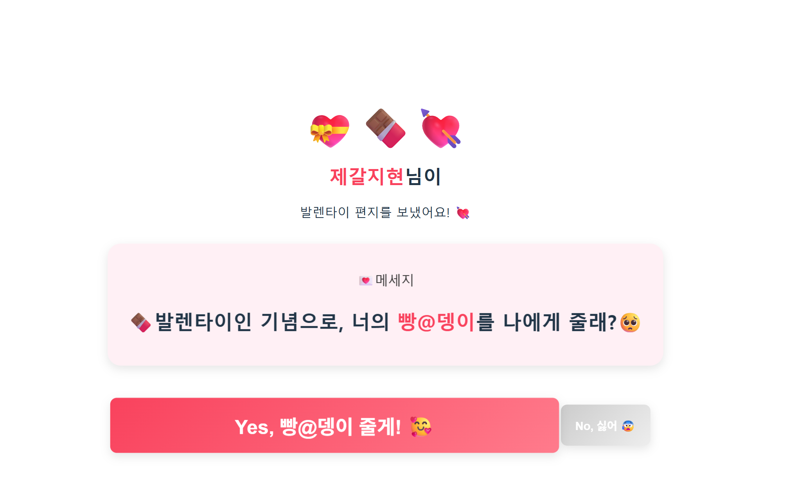

# 💌 답정너 발렌타인데이 웹사이트

## 프로젝트 개요

- **주제:** 발렌타인데이 고백 웹사이트
- **컨셉:** Gmail 링크 클릭 → 답정너 고백 페이지 등장 → YES/NO 선택 구조
- **페이지:** 총 2페이지
  1. 메일 📩 이모지 점점 확대
  2. 발렌타인 편지 + 답정너 버튼

## 프로젝트 구조

```text
valentines-day-app
├── index.html
├── App.jsx
├── App.css
├── assets/
│   └── screenshot.gif
├── pages/
│   ├── IntroPage.jsx
│   └── LetterPage.jsx
└── styles/
  ├── IntroPage.css
  └── LetterPage.css
```

## 주요 기능 설명

### 싫어요 버튼 도망가기 기능

NO 버튼에 마우스를 올리면 랜덤 위치로 이동해 클릭하기 어렵게 만든 재미 요소입니다.

핵심 함수: `moveButtonRandomly()`

```jsx
const moveButtonRandomly = () => {
  const randomX = Math.random() * 80; // X축 이동 범위 제한 (0~80%)
  const randomY = Math.random() * 80; // Y축 이동 범위 제한 (0~80%)

  setIsMoved(true); // absolute 위치 사용 시작
  setPosition({ x: randomX, y: randomY }); // 새 좌표 저장
};

<button
  className="no-button"
  type="button"
  onMouseEnter={moveButtonRandomly} // 마우스가 올라오면 도망
  style={
    isMoved
      ? {
          position: "absolute", // 절대 위치 적용
          left: `${position.x}%`, // X 좌표 적용
          top: `${position.y}%`, // Y 좌표 적용
        }
      : {}
  }
>
  No, 싫어 😰
</button>;
```

### 하트 비 기능

YES 버튼 클릭 시 다양한 하트 이모지가 화면 상단에서 떨어지는 애니메이션이 실행됩니다.

핵심 함수: `handleYesClick()`

```jsx
const handleYesClick = () => {
  alert("빵@뎅이 잘 먹@을게!!🥵"); // 알림 표시
  setShowHearts(true); // 하트 비 활성화
};

{
  showHearts && (
    <div className="heart-rain">
      {Array.from({ length: 40 }).map((_, i) => {
        const randomHeart =
          heartTypes[Math.floor(Math.random() * heartTypes.length)]; // 랜덤 하트

        return (
          <span
            key={i}
            className="heart"
            style={{
              left: `${Math.random() * 100}%`, // X 위치 랜덤
              animationDuration: `${2 + Math.random() * 3}s`, // 속도 랜덤
              fontSize: `${20 + Math.random() * 20}px`, // 크기 랜덤
            }}
          >
            {randomHeart}
          </span>
        );
      })}
    </div>
  );
}
```

## 시연

[](./src/assets/2026_Valentines_Day_project_gif.mp4)

## 기술 스택

- **Frontend:** React + Vite
- **언어:** JavaScript, CSS
- **배포:** Github Pages / Netlify / Vercel
